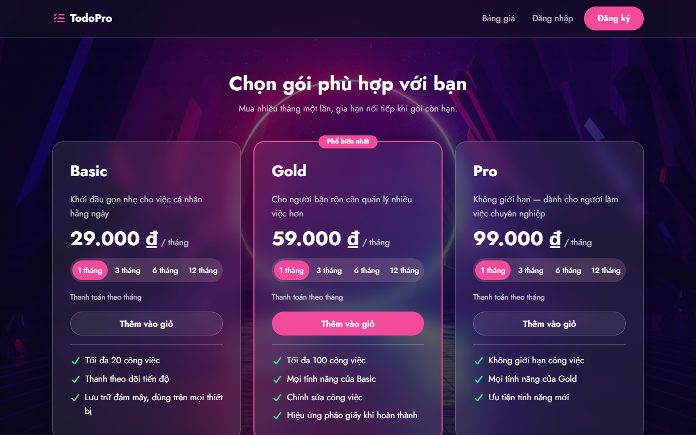
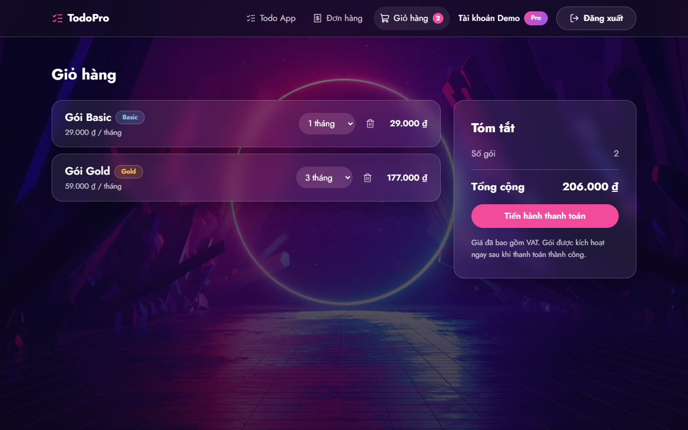
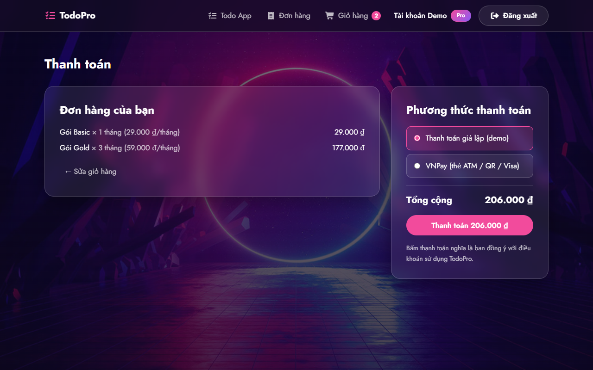
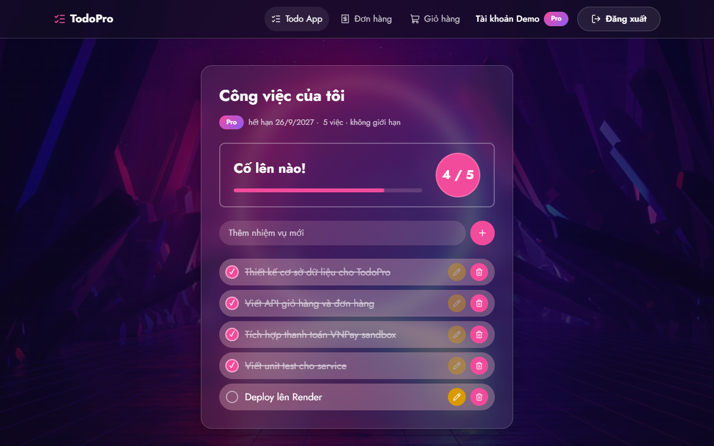
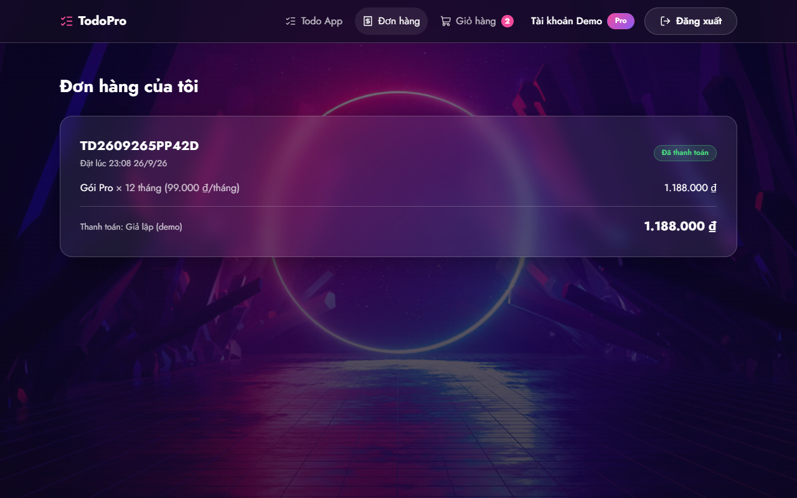
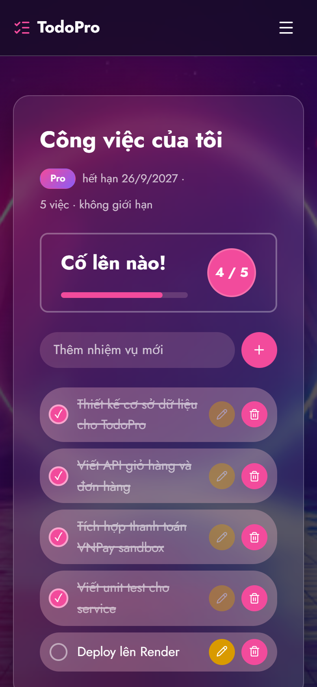
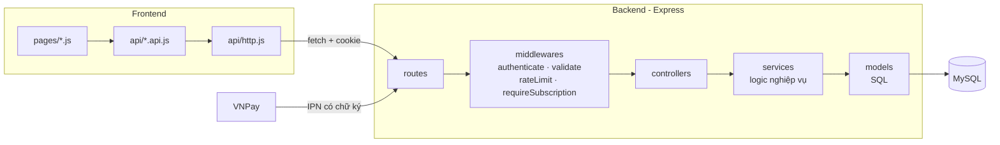

# TodoPro — Website bán gói ứng dụng Todo

[](https://github.com/LuuCuong1912/to-do-llc.github.io/actions/workflows/ci.yml)

Website thương mại điện tử bán gói dịch vụ **Basic / Gold / Pro** cho một ứng dụng Todo List. Người dùng đăng ký, chọn gói, thêm vào giỏ hàng, thanh toán qua **VNPay** (hoặc thanh toán giả lập để demo), và dùng Todo App với giới hạn tính năng theo gói đã mua.

🔗 **Demo trực tiếp:** https://todopro-luucuong.onrender.com (bản miễn phí nên lần mở đầu tiên có thể mất ~50 giây để máy chủ khởi động)

Backend viết theo **kiến trúc nhiều lớp (MVC mở rộng)**: `route → middleware → controller → service → model → MySQL`.


## Tài khoản demo

| Email | Mật khẩu | Gói |
|---|---|---|
| `demo@todopro.vn` | `Demo@12345` | Pro (12 tháng) |

Tạo bằng lệnh `npm run db:seed-demo` (xem [Cài đặt](#cài-đặt-và-chạy-trên-máy)).

## Thử nhanh (khoảng 2 phút)

1. **Không cần tài khoản:** bấm **Dùng thử miễn phí** ở trang chủ để dùng Todo App (tối đa 5 việc)
2. **Mua gói:** đăng ký tài khoản mới → chọn gói → **Thêm vào giỏ** → **Thanh toán**:
   - **Thanh toán giả lập (demo):** 1 cú bấm là xong
   - **VNPay (môi trường thử nghiệm, không trừ tiền thật):** trên trang VNPay chọn thẻ nội địa, nhập thẻ test công khai của VNPay:

     | Ngân hàng | Số thẻ | Chủ thẻ | Ngày phát hành | OTP |
     |---|---|---|---|---|
     | NCB | `9704198526191432198` | `NGUYEN VAN A` | `07/15` | `123456` |

     Trang Thanh toán cũng hiện sẵn thông tin thẻ này khi chọn VNPay
3. **Dùng Todo App** với gói vừa mua, xem lại ở **Đơn hàng**

## Tính năng

- **Landing page**: giới thiệu sản phẩm, bảng giá lấy từ CSDL, chọn số tháng (1 / 3 / 6 / 12)
- **Đăng ký / Đăng nhập**: JWT trong cookie `httpOnly`, mật khẩu mã hóa bcrypt, giới hạn số lần đăng nhập sai
- **Giỏ hàng**: lưu trong CSDL (đăng nhập máy khác vẫn còn), giá luôn tính ở Backend
- **Đơn hàng & thanh toán**: VNPay sandbox (chữ ký HMAC-SHA512, IPN) và thanh toán giả lập
- **Gói dịch vụ**: mua thêm khi còn hạn thì **gia hạn nối tiếp**, luôn áp dụng gói cao nhất đang còn hạn
- **Dùng thử miễn phí**: bấm "Dùng thử" là dùng Todo App ngay, không cần đăng ký (tối đa 5 việc, lưu trên trình duyệt)
- **Todo App theo gói**: Basic tối đa 20 việc, Gold 100 việc + sửa việc + hiệu ứng pháo giấy, Pro không giới hạn
- **Responsive**: dùng tốt trên điện thoại (từ 360px)

| Bảng giá | Giỏ hàng | Thanh toán |
|---|---|---|
|  |  |  |

| Todo App | Đơn hàng | Điện thoại |
|---|---|---|
|  |  |  |

## Công nghệ

| Phần | Công nghệ |
|---|---|
| Frontend | HTML, CSS, JavaScript thuần (ES Modules), không framework |
| Backend | Node.js 20+, Express 5 |
| CSDL | MySQL 8, `mysql2` (SQL viết tay, câu lệnh có tham số) |
| Bảo mật | JWT (cookie httpOnly), bcrypt, helmet (CSP), CORS, express-rate-limit, Joi |
| Thanh toán | VNPay sandbox (API 2.1.0) |
| Kiểm thử | Vitest, Supertest |
| Chất lượng code | ESLint, Prettier |
| Icon, font | [Lucide](https://lucide.dev) (ISC) dạng SVG sprite · font Jost (OFL) tự host, không dùng CDN |

## Kiến trúc



| Lớp | Nhiệm vụ | Không được làm |
|---|---|---|
| Route | Khai báo URL, gắn middleware + controller | Viết logic |
| Middleware | Đăng nhập, kiểm tra dữ liệu, quyền theo gói, bắt lỗi | Truy vấn nghiệp vụ |
| Controller | Đọc `req`, gọi service, trả `res` | Viết SQL |
| Service | Toàn bộ logic nghiệp vụ, transaction | Đụng tới `req`/`res` |
| Model | Câu SQL | Logic nghiệp vụ |

Sơ đồ CSDL (8 bảng) và lý do thiết kế: [docs/database.md](docs/database.md) · Danh sách API: [docs/api.md](docs/api.md)

## Điểm kỹ thuật đáng chú ý

- **Chống thanh toán 2 lần**: khóa đơn hàng bằng `SELECT ... FOR UPDATE` trong transaction. Gửi 3 request thanh toán cùng lúc thì chỉ 1 thành công
- **Chống vượt giới hạn số việc**: khóa dòng user trước khi đếm. Gửi 5 request cùng lúc khi còn 2 chỗ thì chỉ 2 request được thêm
- **VNPay**: kiểm tra chữ ký HMAC-SHA512 (so sánh thời gian cố định), đối chiếu số tiền, xử lý IPN gửi lặp (không cộng gói 2 lần), chỉ tin IPN chứ không tin Return URL
- **Giá không tin Frontend**: giỏ hàng và đơn hàng luôn tính tiền từ bảng `packages`. `order_items` lưu lại giá lúc mua
- **Chống XSS**: Frontend tạo DOM bằng `textContent`, không đưa dữ liệu người dùng vào `innerHTML`. CSP chặn script lạ
- **Chống dò tài khoản**: đăng nhập sai email hay sai mật khẩu đều trả cùng thông báo và cùng thời gian phản hồi
- **Chống Open Redirect**: tham số `?redirect=` chỉ nhận đường dẫn nội bộ

## Chạy nhanh bằng Docker (1 lệnh)

**Yêu cầu:** Docker Desktop. Không cần cài Node.js hay MySQL.

```bash
docker compose up --build
```

Mở **http://localhost:8080** rồi đăng nhập `demo@todopro.vn` / `Demo@12345`. Lệnh trên dựng MySQL, tạo bảng, 3 gói và tài khoản demo, sau đó chạy server.

- Tắt: `docker compose down`
- Tắt và xóa dữ liệu: `docker compose down -v`

## Cài đặt và chạy trên máy (để phát triển)

**Yêu cầu:** Node.js 20+, MySQL 8, VS Code + extension Live Server

```bash
# 1. Cài thư viện Backend
cd backend
npm install

# 2. Tạo file cấu hình rồi điền thông tin MySQL (xem hướng dẫn trong file)
cp .env.example .env

# 3. Tạo database, bảng, 3 gói và tài khoản demo
npm run db:setup
npm run db:seed-demo

# 4. Chạy Backend (http://localhost:3000)
npm run dev
```

**Frontend:** mở thư mục dự án bằng VS Code và bấm **Go Live**. Cấu hình Live Server gồm: root = `/frontend`, host `127.0.0.1`, port `5500`. Sau đó mở `http://127.0.0.1:5500`.

<details>
<summary>Cấu hình Live Server (<code>.vscode/settings.json</code>)</summary>

```json
{
  "liveServer.settings.root": "/frontend",
  "liveServer.settings.host": "127.0.0.1",
  "liveServer.settings.port": 5500
}
```

</details>

## Lệnh thường dùng

| Thư mục | Lệnh | Tác dụng |
|---|---|---|
| `backend/` | `npm run dev` | Chạy server, tự khởi động lại khi sửa code |
| `backend/` | `npm test` | Unit test (không cần MySQL) |
| `backend/` | `npm run test:integration` | Test tích hợp với MySQL thật (tự dọn dữ liệu test) |
| `backend/` | `npm run db:setup` | Tạo database / bảng / gói, đồng bộ index (chạy lại an toàn) |
| `backend/` | `npm run db:reset` | Xóa sạch và tạo lại database (chỉ dev) |
| `backend/` | `npm run db:seed-demo` | Tạo tài khoản demo |
| gốc | `npm run test:e2e` | Test trên trình duyệt (Playwright, tự bật server cổng 3100) |
| gốc | `npm run lint` / `npm run format` | ESLint / Prettier cho cả frontend và backend |
| gốc | `npm run sync:head` | Chép phần `<head>` chung (`frontend/partials/head.html`) vào mọi trang |

## Kiểm thử

| Loại | Số lượng | Công cụ | Kiểm tra gì |
|---|---|---|---|
| Unit | 51 | Vitest (giả lập model) | Logic nghiệp vụ: giá, giới hạn gói, hết hạn đơn, chữ ký VNPay, chống CSRF |
| Tích hợp | 28 | Vitest + Supertest + **MySQL thật** | API từ đầu đến DB: thanh toán đồng thời, gia hạn gói, IPN VNPay, giới hạn số việc |
| E2E | 13 | **Playwright** + trình duyệt thật | Luồng người dùng: đăng ký, mua gói, VNPay, dùng thử, hủy đơn, điện thoại 375px |

**CI (GitHub Actions)** chạy toàn bộ các test trên cùng ESLint và Prettier mỗi lần push, dùng MySQL 8.4 dựng trong CI.

Trên máy cá nhân, lệnh `npm install` ở thư mục gốc sẽ cài Playwright; test E2E dùng Google Chrome có sẵn trên máy.

## Cấu trúc thư mục

```
frontend/
├── index.html              Landing page
├── pages/                  login, register, cart, checkout, payment-result, orders, app (Todo)
├── partials/head.html      Phần <head> dùng chung (npm run sync:head)
├── css/                    base (biến thiết kế) · components · layout · feedback · pages/
└── js/
    ├── api/                Gọi Backend — http.js là nơi DUY NHẤT dùng fetch
    ├── components/         navbar, toast, package-card, todo-item, order-summary
    ├── utils/              auth-guard, dom (tạo HTML an toàn), form, format, payment-flow
    └── pages/              Mỗi trang 1 file
backend/
├── src/
│   ├── routes/ middlewares/ validators/ controllers/ services/ models/
│   ├── services/payment/   mock · vnpay · methods
│   ├── config/             env, db (pool + transaction)
│   └── app.js, server.js
├── database/               schema.sql, seed.sql, setup.js, seed-demo.js, cleanup-test-users.js
└── tests/                  unit/ (service) · api/ (supertest) · integration/ (MySQL thật)
e2e/                        Test Playwright (*.spec.js)
scripts/                    sync-head.js
.github/workflows/ci.yml    CI: lint + unit + tích hợp + e2e
Dockerfile, docker-compose.yml
docs/                       database.md, api.md, deploy.md, screenshots/, postman/
```

## Tích hợp VNPay sandbox

1. Đăng ký tài khoản merchant thử nghiệm tại [sandbox.vnpayment.vn/devreg](https://sandbox.vnpayment.vn/devreg/) để nhận `TMN_CODE` và `HASH_SECRET`
2. Điền `VNP_TMN_CODE`, `VNP_HASH_SECRET` trong `backend/.env`. Khi 2 biến này có giá trị, phương thức VNPay tự hiện ra ở trang thanh toán
3. VNPay không gọi được IPN vào `localhost`. Khi chạy trên máy, đặt `VNP_CONFIRM_ON_RETURN=true` (chỉ dùng khi dev), hoặc dùng [ngrok](https://ngrok.com) / Cloudflare Tunnel rồi khai báo URL IPN `https://<domain>/api/payments/vnpay/ipn` trong trang quản lý sandbox

## Deploy

Xem [docs/deploy.md](docs/deploy.md). Cách đơn giản nhất là deploy **1 dịch vụ** trên Render: Express phục vụ luôn thư mục `frontend/` (`SERVE_FRONTEND=true`), kết hợp MySQL trên Aiven, TiDB Cloud hoặc Railway.
