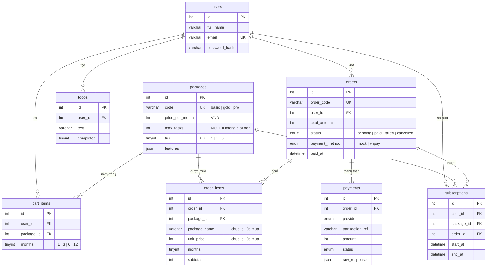

# Cơ sở dữ liệu — TodoPro

MySQL 8, bảng mã `utf8mb4`. Định nghĩa đầy đủ: [`backend/database/schema.sql`](../backend/database/schema.sql). Dữ liệu mẫu: [`seed.sql`](../backend/database/seed.sql).

## Quyết định thiết kế

| Quyết định | Lý do |
|---|---|
| Tiền lưu `INT UNSIGNED` (đồng) | VND không có số lẻ, `FLOAT` gây sai số khi cộng tiền |
| `order_items` lưu `package_name` và `unit_price` | Sau này đổi giá gói thì đơn cũ vẫn đúng số tiền đã trả |
| `UNIQUE(user_id, package_id)` trong `cart_items` | Mỗi gói chỉ 1 dòng trong giỏ, thêm lại thì cập nhật số tháng |
| `packages.tier` UNIQUE | So sánh gói cao/thấp để xác định gói đang dùng |
| `orders.user_id` là `ON DELETE RESTRICT` | Không để mất lịch sử đơn hàng / thanh toán khi xóa user |
| `cart_items`, `todos` là `ON DELETE CASCADE` | Xóa user thì dữ liệu tạm của họ không còn ý nghĩa |
| `UNIQUE(provider, transaction_ref)` trong `payments` | Cổng thanh toán gửi lại cùng một giao dịch nhiều lần thì cũng không bị ghi trùng |
| Index `(user_id, end_at)` trong `subscriptions` | Truy vấn "gói còn hạn của user" chạy rất thường xuyên |
